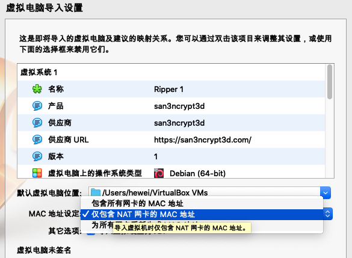
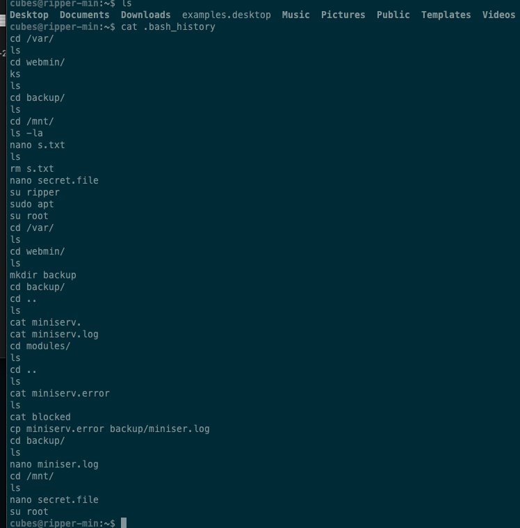

---

---

### 第15周打靶


## 声明

​	这个是一起来打靶课程的个人学习记录和思考.课程非常的nice，欢迎订阅，一起来打靶吧！


- 靶机地址：https://download.vulnhub.com/ripper/Ripper.ova

  选择导入virtualBox，Mac地址设定选择：包含所有网卡的MAC 地址，不然可能无法为虚拟机分配IP，局域网扫描就发现不了主机

  

- arpscan 发现目标主机

  VB虚拟机MAC地址以 08:00: 开头，所以一眼就能发现，真要做攻击，内外扫描可能会用到，外网应该已经有目标对象，IP 或者域名

- nmap 发现服务开放端口和对应的服务

  - 想尝试全端口扫描，

    ```
    nmap -p- 192.168.3.99
    ```

    nmap还有很多参数，尤其有个T参数，好像是限定扫描速度的，避免被发现，因为是打靶，所以无所谓了，真实环境肯定是会做伪装

  - 扫描发现开放了三个端口,其中1000 端口我感觉比较陌生

    ```
    22/tcp    open  ssh
    80/tcp    open  http
    10000/tcp open  snet-sensor-mgmt
    ```

  - 再对队指定端口扫描看看跑的都是什么服务 , 

    ```
     nmap -p22,80,10000 -sV -sC 192.168.3.99
    ```

    80端口依然是apache服务

    10000 是 MiniServ 1.910 (Webmin httpd)，估计这就是目标了。（Ps：我觉得找目标点，应该是在突破过程中，一个比较重要的步骤，打靶的目的也是在这种训练中，寻找感觉的，然后总结，然后化作经验，用到真实环境中。）

- 针对指定服务信息收集

  - 这里直接报错，需要使用https 协议，所以使用https://192.168.3.99:10000/打开网站。如果用Chrome应该还是报错，我打靶是在mac上，于是尝试用Safari和Firefox，发现会有警告，选择继续访问就好了，需要你信任。

  - 弱密码尝试登录10000服务，没得用啊，也没有考虑去爆破了

  - 查看80端口下robots.txt ，--> 报错

  - 查看10000端口下robots.txt, --> 获取到爬虫不准扫描路径，这里是个base64字符串，所以解析一波

    ```
    echo -n "d2Ugc2NhbiBwaHAgY29kZXMgd2l0aCByaXBzCg" | base64 -d
    ##输出     we scan php codes with rips
    ```

    这个rips是个PHP的静态扫描工具，搜索关键字 php rips 可以找到相关信息。这里可以思考一下，这东西肯定有个控制台地址，所以我们去官网应该是奔着默认的管理后台地址去。结果发现路径就是 **/rips**

    - 80端口和10000 端口服务访问/rips路径，发现80端口可用，10000 端口不行。注意，80端口服务是http连接

    

  - 我也尝试用dirsearch和gobuster是不是可以直接暴力获取下80端口服务的路径地址.发现没有有用信息，应该是字典问题，没有爆破到/rips路径

- 查询PHP源码中的敏感信息

  - 既然已经获取到了静态扫描控制台，那就可以直接扫描一波这个项目本身。代码本身确实是有漏洞

    那验证一下，看看能不能拿到系统的密码信息

    ```
    http://192.168.3.99/rips/windows/code.php?file=../../../../../etc/passwd
    ## 这里这里报错，无法利用
    
    http://192.168.3.99/rips/windows/code.php?file=/var/www/html/rips/windows/code.php
    ## 这里直接引用项目本身，发现可以看到对应文件源码。
    
    ```

    但这也没用啊，无法突破边界，登录不了管理员系统

  - 发现静态扫描系统还有文件内容正则匹配的搜索，那肯定要试试那些密码关键字信息，搜索  pass 

    - 发现了10个匹配，其中/var/www/html/rips/secret.php里看起来有点不一样，命名上也可以感觉到，通过控制台的file按钮看一下全部文件内容，发现还有个username叫ripper，凑起来就是账户和密码，先不管，搜集起来。   

      

      

    - 获得了有账号密码，那就去试试要账号和密码的地方

      - 10000 端口尝试，不行，密码错误
      - 22 端口服务尝试，OK，**成功。说明已经突破了边界啦**
      - 登录后在ripper 目录下，有第一个flag：flag{15ea80f080be3714df1ef97bac5d7151}

- 查看内核版本 

  - uname -a 查看内核版本信息

    ```
    - Linux ripper-min 5.4.0-42-generic #46~18.04.1-Ubuntu SMP Fri Jul 10 07:21:24 UTC 2020 x86_64 x86_64 x86_64 GNU/Linux
    
    ```

    这是ubuntu18.04的版本，可以利用[cve-2021-3493](https://github.com/briskets/CVE-2021-3493.git) 进行提权。尝试mac编译，直接报GCC编译出错，算了，还是启动kali来搞吧

  - 编译后获得了 exp，scp到目标机器，./exp 执行，接获得了root权限。 

- ##### 上面是利用了系统的漏洞，这个漏洞说最近才披露，所以以前的靶机，很多都可以用。现在尝试用作者的思路来提权

- 收集起他账号的信息，文件属于其他用户，但另一个用户可读，find 命令

  ```
  find / -user cubes -type f -exec ls  -la {} \; 2>/dev/null
  # 搜索归属于cubes 账户的文件，将错误定向到空设备，也就是不用输出
  # 结果如下
  w-r--r-- 1 cubes cubes 807 Jun  4 11:28 /home/cubes/.profile
  -rw-r--r-- 1 cubes cubes 3771 Jun  4 11:28 /home/cubes/.bashrc
  -rw------- 1 cubes cubes 334 Jun  4 13:25 /home/cubes/.ICEauthority
  -rw-r--r-- 1 cubes cubes 8980 Jun  4 11:28 /home/cubes/examples.desktop
  -rw-r--r-- 1 cubes cubes 220 Jun  4 11:28 /home/cubes/.bash_logout
  -rw------- 1 cubes cubes 384 Jun  4 11:48 /home/cubes/.bash_history
  -rw-rw-r-- 1 cubes cubes 60 Jun  4 11:42 /mnt/secret.file
  
  ```

  这明显的secret.file 文件有问题，cat 一下，看看里边有啥

  ```
  This is my secret file
  
  [file system]
  -passwd : Il00tpeople
  ```

  这看起来是密码了，估计是cubes账户的，毕竟这个文件的属主就是cubes。所以切换下cubes账户，输入获取的密码，成功！已经到了cubes用户目录了

  - 再来搜索下 属主属cubes用户的文件，发现有很多进程文件，使用grep 过滤一下，获得如下文件。

    ```
    find / -user cubes -type f -exec ls -la {} \; 2>/dev/null |grep -v "proc"
    ```

    其中，那个叫做 /var/webmin/backup/miniser.log 文件看起来像是webmin的日志文件，尝试去看看，发现了日志中一个错误搜全日志，内容理由账号和密码 `session_login.cgi=username=admin&pass=tokiohote`。既然有账户和密码，那可定要走一波登录相关的功能，主要就是ssh和10000端口上的服务，这次，在10000端口的服务上，起作用了，说明这个账号和密码是有用的 。登录后进入web命令行执行ID命令，发现自己拥有管理员权限

管理员权限，获取flag成功


#### 打靶完成！！！！

PS：老师提供另一种思路就是利用公开的漏洞，利用msf。

1. 利用 `searchsploit webmin `  可以找到公开的漏洞
2. 启动msf  `sudo msfdb run`
3. 执行 `search webmin` 查找payload，这个漏洞利用，**需要依赖webmin 后台的账号和密码**
4. 执行 `user 2` 表示使用该payload
5. 执行 `show options` 查看利用方式和参数配置等信息
6. 使用 set 命令配置各个参数，run 命令开始执行payload


### 其他思考

1. 其实在突破边界进入系统后不管是riper账户还是cubes，都可以利用  .bash_history  文件，查看用户的终端操作, 但这样做，有点作弊的感觉。因为靶机作者这里根本就没有清理这些痕迹😂




##### 收集到的账号信息汇总

```
secret.php：  ripper ， Gamespeopleplay
/mnt/secret.file  pass：Il00tpeople 文件属主：cubers
/var/webmin/backup/miniser.log   admin   tokiohotel
```


